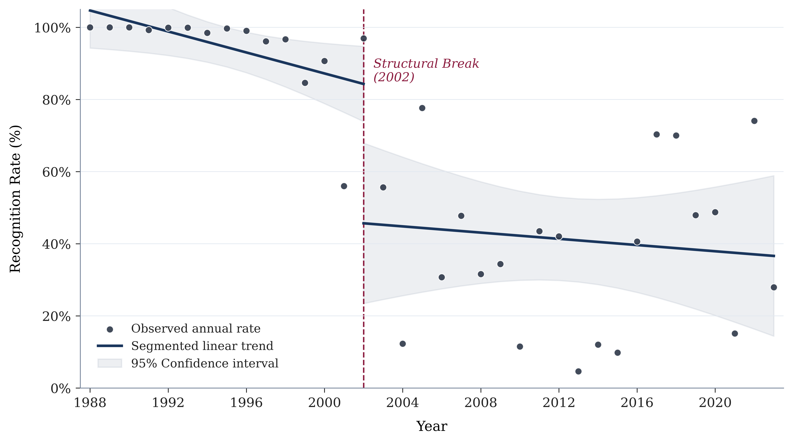

## Evolution of drought recognition

The recognition of geotechnical drought under the French CatNat scheme has evolved considerably over time. Figure 2 reports the annual recognition rate for drought-related CatNat applications from the first recorded event in 1989 and reveals a clear shift in administrative recognition over the study period.

*Figure 1: Annual recognition rate for drought-related CatNat applications and estimated structural break.*

During the first decade of the scheme, recognition rates remained close to 100%, indicating that municipal applications were almost systematically approved. From the early 2000s onward, however, recognition became markedly more selective and annual approval rates exhibited substantially greater variability. Rather than reflecting temporary year-to-year fluctuations, this pattern suggests a lasting change in the decision-making process.

Figure 1 further illustrates this evolution using segmented linear trends estimated before and after the identified breakpoint, together with their 95% confidence intervals. To formally assess whether the apparent shift corresponds to a genuine change in the recognition process, we estimate a breakpoint using a binary segmentation algorithm based on the minimization of the residual sum of squares. The estimated breakpoint occurs in 2002, providing statistical evidence of a structural break in administrative recognition.

This result has important implications for the empirical analysis. Before 2002, the near-systematic approval of municipal applications leaves little variation for explaining administrative decisions. By contrast, the post-2002 period corresponds to a genuinely selective decision process in which both accepted and rejected applications coexist under the same institutional framework. This period therefore provides an appropriate setting to investigate whether recognition decisions are consistent with the physical characteristics of geotechnical drought and whether municipalities exposed to comparable conditions receive comparable administrative treatment. Accordingly, all subsequent analyses are conducted on the post-2002 period.
